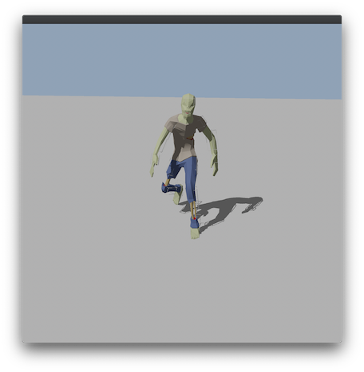
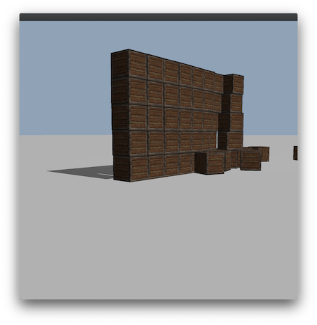

<p align="center">
  
</p>

# IRIS
Iris is a cross-platform game engine written in modern C++

[](https://github.com/irisengine/iris/actions/workflows/build.yml)  [](https://www.boost.org/LICENSE_1_0.txt) 

# Table of Contents
1. [Screenshots](#screenshots)
2. [Features](#features)
3. [Dependencies](#dependencies)
4. [Included third-party libraries](#included-third-party-libraries)
5. [Using iris](#using-iris)
    1. [Prebuilt libraries](#prebuilt-libraries)
    2. [System install](#system-install)
    3. [Build in project](#build-in-project)
6. [Building](#building)
    1. [Options](#options)
    2. [Command line](#command-line)
    3. [Visual Studio Code / Visual Studio](#visual-studio-code-visual-studio)
    5. [Xcode](#xcode)
7. [Examples](#examples)
8. [Design](#design)
    1. [Versioning](#versioning)
    2. [Compile/Runtime choices](#compileruntime-choices)
    3. [Managers](#managers)
    4. [Memory management](#memory-management)
    5. [core](#core)
    6. [events](#events)
    7. [graphics](#graphics)
        1. [render_graph](#render_graph)
    8. [jobs](#jobs)
    9. [log](#log)
    10. [networking](#networking)
    11. [physics](#physics)

---

## Screenshots



## Features
* Cross platform: Windows, macOS and iOS
* Multiple rendering backends: D3D12, Metal, OpenGL 
* 3D rendering and physics
* HDR
* Graph based shader compiler
* Skeleton animation
* Job based paralelism (fiber and thread implementations)
* Networking

## Dependencies
The following dependencies are required to build iris:
1. cmake > 3.18
2. C++20 compiler

The following compilers have been tested

| Compiler | Version | Platform |
| -------- | ------- | -------- |
| clang | 12.0.1 | macOS |
| clang | 11.0.0 | macOS |
| Apple clang | 12.0.0 | macOS |
| Apple clang | 12.0.0 | iOS |
| msvc | 19.29.30133.0 | windows |

## Included third-party libraries
The following dependencies are automatically checked out as part of the build:

| Dependency | Version | License |
| ---------- | ------- | ------- |
| [assimp](https://github.com/assimp/assimp) | [5.0.1](https://github.com/assimp/assimp/releases/tag/v5.0.1) | [](https://github.com/assimp/assimp/blob/master/LICENSE)|
| [bullet](https://github.com/bulletphysics/bullet3) | [3.17](https://github.com/bulletphysics/bullet3/releases/tag/3.17) | [](https://opensource.org/licenses/Zlib) |
| [stb](https://github.com/nothings/stb) | [c0c9826](https://github.com/nothings/stb/tree/c0c982601f40183e74d84a61237e968dca08380e) | [](https://opensource.org/licenses/MIT) / [](http://unlicense.org/)|
| [googletest](https://github.com/google/googletest.git) | [1.11.0](https://github.com/google/googletest/releases/tag/release-1.11.0) | [](https://opensource.org/licenses/BSD-3-Clause) |
| [directx-headers](https://github.com/microsoft/DirectX-Headers.git) | [1.4.9](https://github.com/microsoft/DirectX-Headers/releases/tag/v1.4.9) | [](https://opensource.org/licenses/MIT) |


## Using iris
Iris (and all of its dependencies) are built as static libraries. There are three ways you can include iris in your project. These all assume you are using cmake, it is theoretically possible to integrate iris into other build systems but that is beyond the scope of this document.

### Prebuilt libraries
Prebuilt binaries (and required headers) are available in [releases](https://github.com/irisengine/iris/releases). Simply download, extract and copy somewhere. They can be either checked into your project or stored externally. Then simply add the following to your project cmake:
```cmake
find_package(iris REQUIRED PATHS path/to/iris/lib/cmake)
target_link_libraries(my_project iris::iris)
```

### System install
After [building](#command-line) run the following as root/admin from the build directory to install iris into your system:
```cmake
cmake --install .
```

Then simply add the following to your project:
```cmake
find_package(iris REQUIRED)
target_link_libraries(my_project iris::iris)
```

### Build in project
It is also possible to build iris as part of your project. Add the source to your project (either by copying the files or as a git submodule). Then add the following to your project:
```cmake
add_subdirectory(iris)
target_include_directories(my_project PRIVATE iris/include)
target_link_libraries(my_project iris::iris)
```

Alternatively you can let cmake handle the checking out of iris:
```cmake
FetchContent_Declare(
  iris
  GIT_REPOSITORY https://github.com/irisengine/iris
  GIT_TAG v1.0.0)
FetchContent_GetProperties(iris)
if(NOT iris_POPULATED)
  FetchContent_Populate(iris)
  add_subdirectory(${iris_SOURCE_DIR} ${iris_BINARY_DIR} EXCLUDE_FROM_ALL)
endif()

target_include_directories(my_project PRIVATE iris/include)
target_link_libraries(my_project iris::iris)
```

## Building

### Options
| Cmake option | Default value |
| ------------ | ------------- |
| IRIS_BUILD_UNIT_TESTS | ON |

The following build methods are supported

### Command line
The following commands will build a debug version of iris. Note that this also works in PowerShell

```bash
mkdir build
cd build
cmake ..
cmake --build .

# to run tests
ctest
```

### Visual Studio Code / Visual Studio
Opening the root [`CMakeLists.txt`](/CMakeLists.txt) file in either tool should be sufficient. For vscode you will then have to select an appropriate kit. On Windows you will need to ensure the "Desktop development with C++" workload is installed.

Tests can be run with a googletest adaptor e.g. [visual studio](https://docs.microsoft.com/en-us/visualstudio/test/how-to-use-google-test-for-cpp?view=vs-2019) or [vscode](https://marketplace.visualstudio.com/items?itemName=DavidSchuldenfrei.gtest-adapter)

### Xcode
You will need to generate the Xcode project files.

For macOS:
```bash
mkdir build
cd build
cmake -GXcode ..
```

For iOS:
```bash
mkdir build
cd build
cmake .. -G Xcode -DCMAKE_TOOLCHAIN_FILE=../toolchains/ios.toolchain.cmake -DDEPLOYMENT_TARGET=14.3
```

## Examples

The samples directory contains some basic usages.
* [sample_browser](/samples/sample_browser) - single executable with multiple graphics samples (tab to cycle through them)
* [jobs](/samples/jobs) - a quick and dirty path tracer to showcase and test the jobs system
* [networking](/samples/networking) - a client and server applications showcasing networking, client side prediction and lag compensation


Some additional snippets are included below.

**Create a window**
```c++
#include "iris/core/root.h"
#include "iris/events/event.h"
#include "iris/graphics/window.h"
#include "iris/graphics/window_manager.h"

void go(int, char **)
{
    auto *window = iris::Root::window_manager().create_window(800, 800);
    auto running = true;

    do
    {
        auto event = window->pump_event();
        while (event)
        {
            if (event->is_key(iris::Key::ESCAPE))
            {
                running = false;
                break;
            }

            event = window->pump_event();
        }

        window->render();
    } while (running);
}

int main(int argc, char **argv)
{
    iris::start(argc, argv, go);
}
```

*All further snippets will assume be in `go` and will omit headers for brevity*

**Render a red cube**
```c++
    auto *window = iris::Root::window_manager().create_window(800, 800);
    auto running = true;

    iris::Scene scene;
    scene.create_entity(
        nullptr,
        iris::Root::mesh_manager().cube({1.0f, 0.0f, 0.0f}),
        iris::Transform{{0.0f, 0.0f, 0.0f}, {}, {10.0f, 10.0f, 10.0f}});

    iris::Camera camera{iris::CameraType::PERSPECTIVE, 800, 800};

    window->set_render_passes({{&scene, &camera, nullptr}});

    do
    {
        auto event = window->pump_event();
        while (event)
        {
            if (event->is_key(iris::Key::ESCAPE))
            {
                running = false;
                break;
            }

            event = window->pump_event();
        }

        window->render();
    } while (running);
```

## Design

### Versioning
The public API of iris is versioned using [semver](https://semver.org/). This means that when upgrading you can expect the following outcomes:
* Major version -> your project could no longer compile/link
* Minor version -> your project may not function the same as before
* Patch version -> your project should function the same, if you were not relying on the broken behavior.

The internal API could change frequently and should not be used. As a rule of thumb the public API is defined in any header file in the top-level folders in `inlcude/iris` and any subfolders are internal.

### Compile/Runtime choices
Iris provides the user with several runtime choices e.g. rendering backend and physics engine. These are all runtime decisions (see [Managers](#managers)) and implemented via classic class inheritance. Some choices don't make sense to make at runtime e.g. `Semaphore` will be implemented with platform specific primitives so there is no runtime choice to make. To remove the overheard of inheritance and make this a simple compile time choice we define a single header ([semaphore.h](/include/iris/core/semaphore.h)) with the API and provide several different implementations ([macos](/src/core/macos/semaphore.cpp), [windows](/src/core/win32/semaphore.cpp)). Cmake can then pick the appropriate one when building. We use the [pimpl](https://en.cppreference.com/w/cpp/language/pimpl) idiom to keep implementation details out of the header.

### Managers
In order to easily facilitate the runtime selection of components iris makes use of several manager classes. A manager class can be thought of as a factory class with state. Managers are registered in [`Root`](/include/iris/core/root.h) and then accessed via the [`Root`](/include/iris/core/root.h) API. [`start()`](/include/iris/core/start.h) registers all builtin components for a given platform and sets sensible defaults. It may seem like a lot of machinery to have to registers managers, access them via [`Root`](/include/iris/core/root.h) then use those to actually create the objects you want, but the advantage is a complete decoupling of the implementation from [`Root`](/include/iris/core/root.h). It is therefore possible to provide your own implementations of these components, register, then use them.

### Memory management
Iris manages the memory and lifetime of primitives for the user. If the engine is creating an object and returns a pointer it can be assumed that the pointer is not null and will remain valid until explicitly returned to the engine by the user.

### [`core`](/include/iris/core)
The directory contains primitives used throughout the engine. Details on some key parts are defined below.

#### Root
The [`Root`](/include/iris/core/root.h) provides singleton access to various core parts of iris, including the registered [managers](#managers).

#### Start
The [`start`](/include/iris/core/start.h) function allows iris to perform all engine start up and tear down before handing over to a user supplied function. All iris functions are undefined if called outside the provided callback.

#### Error handling
In iris errors are handled one of two ways, depending on the nature of the error:
1. Invariants that must hold but are not recoverable - in this case `expect` is used and `std::abort` is called on failure. This is analogous to an assert and thy are stripped in release. Example: failing to allocate a graphics api specific buffer.
2. Invariants that must hold but are recoverable - in this case `ensure` is used and an exception is thrown on failure. This allows someone further up the stack to catch and recover. Example: loading a texture from a missing file.

It's not always clear cut when which should be used, the main goal is that all potential errors are handled in some way. See [error_handling.h](/include/iris/core/error_handling.h) for `expect` and `ensure` documentation.

### [`events`](/include/iris/events)
These are user input events e.g. key press, screen touch. They are captured by a `Window` and can be pumped and then processed. Note that every tick all available events should be pumped.

```c++
auto event = window->pump_event();
while (event)
{
    // handle event here

    event = window->pump_event();
}
```

### [`graphics`](/include/iris/graphics)
All rendering logic is encapsulated in graphics. API agnostic interfaces are defined and implementations can be selected at runtime.

A rough breakdown of the graphics design is below. The public interface is what users should use. The arrow is (mostly) used to denote ownership.

```text


                                                 +--------------+    +---------------------+
                                            .--->| GraphicsMesh |--->| Graphics primitives |
                                            |    +--------------+    +---------------------+
                                            |
                                            |    +----------------+    +------------------+
                                            .--->| ShaderCompiler |--->| GraphicsMaterial |
                                            |    +----------------+    +------------------+
                                            |
                                            |    +--------------------+
                                            .--->| RenderQueueBuilder |
                                            |    +--------------------+
                                            |
                                            |
                   +----------+    +------------------+
                   | OSWindow |    | GraphicsRenderer |
                   +----------+    +------------------+
                         |              | 
                         |              |
private interface        |              |
~~~~~~~~~~~~~~~~~~~~~~~~~|~~~~~~~~~~~~~~|~~~~~~~~~~~~~~~~~~~~~~~~~~~~~~~~~~~~~~~~~~~~~~~~~~~~
public interface         |              |
                         |              |
                         |              |
+---------------+    +--------+    +----------+     +----------+
| WindowManager |--->| Window |--->| Renderer |---->| render() |
+---------------+    +--------+    +----------+     +----------+
                         |
                         |   +---------------------+    +-------+                    
                         '-->| set_current_scene() |<---| Scene |                    
                             +---------------------+    +-------+                    
                                                            |    +--------------+
                                                            '--->| RenderEntity | 
                                                            |    +--------------+
                                                            |           |    +------+
                                                            |           '--->| Mesh |
                                                            |           |    +------+
                                                            |           |    +----------+
                                                            |           '--->| Skeleton |
                                                            |                +----------+
                                                            |    +-------------+
                                                            '--->| RenderGraph |
                                                            |    +-------------+
                                                            |    +-------+
                                                            '--->| Light |
                                                                 +-------+

```

#### [`render_graph`](/include/iris/graphics/render_graph)
The render graph allows a user to define the effect of shaders in a shader language agnostic way. This is then compiled into the appropriate shader code (GLSL, HLSL, MSL) for the current window. [`Scene`](/include/iris/graphics/scene.h) creates and owns a [`RenderGraph`](/include/iris/graphics/render_graph/render_graph.h) which can be used for any [`RenderEntity`](/include/iris/graphics/render_entity.h) in that [`Scene`](/include/iris/graphics/scene.h) (it is undefined to use [`RenderGraph`](/include/iris/graphics/render_graph/render_graph.h) object in a [`Scene`](/include/iris/graphics/scene.h) that did not create it).

A [`RenderGraph`](/include/iris/graphics/render_graph/render_graph.h) owns a [`RenderNode`](/include/iris/graphics/render_graph/render_node.h) which is the root of the graph. To configure the output of the shader the inputs of the [`RenderNode`](/include/iris/graphics/render_graph/render_node.h) should be set. An example:

**Basic bloom**
```text
            Render
Main scene ~~~~~~~~ -----.
                         |
.------------------------'
|                                                                                        
|                  +---------------------+
|---------------.  |   Arithmetic Node   |      +----------------------+  +--------------+  
|               |  |=====================|      |   Conditional Node   |  | Render Node  |~~~~~~ -.
| +-----------+ '->O value1              |      |======================|  |==============|        |
| | Threshold | -->O value2              |----->O input_value1         |->O colour_input |        |
| +-----------+ .->O arithmetic operator | .--->O input_value2         |  +--------------|        |
|               |  +---------------------+ |.-->O output_value1        |                          |
| +-----+       |                          ||.->O output_value2        |                          |
| | DOT |-------'  +------+                |||.>O conditional_operator |                          |
| +-----+          | 1.0f |----------------'||| +----------------------+                          |
|                  +------+                 |||                                                   |
|-------------------------------------------'||                                                   |
|                  +-------------+           ||                                                   |
|                  | Zero colour |-----------'|                                                   |
|                  +-------------+            |                                                   |
|                                             |                                                   |
|                  +---------+                |                                                   |
|                  | GREATER |----------------'                                                   |
|                  +---------+                                                                    |
|                                                                                                 |
| .-----------------------------------------------------------------------------------------------'
| |
| |
| |    +------------+     +--------------+
| |    | Blur Node  |     | Render Node  |
| |    |============|     |==============| ~~~~~ --.
| '--->O input_node |---->O colour_input |         |
|      +------------+     +--------------+         |
|                                                  |
|           .--------------------------------------'
|           |
|           |   +---------------------+
|           |   | Arithmetic Node     |        +--------------+
|           |   |=====================|        | Render Node  |
|           '-->O value1              |        |==============|~~~~~~~~~~> Screen
'-------------->O value2              |------->O colour_input |
            .-->O arithmetic operator |        +--------------+
 +-----+    |   +---------------------+
 | ADD |----'
 +-----+
```

Which in code would look something like:
```c++
iris::Scene main_scene;
auto *main_rt = window->create_render_target();
main_scene.create_entity(
    nullptr,
    iris::Root::mesh_manager().cube({100.0f, 0.0f, 0.0f}),
    iris::Transform{{0.0f, 0.0f, -10.0f}, {}, {10.0f, 10.0f, 10.0f}});

iris::Scene bright_pass_scene;
auto *bright_pass_rt = window->create_render_target();
auto *bright_pass_rg = bright_pass_scene.create_render_graph();
bright_pass_rg->render_node()->set_colour_input(bright_pass_rg->create<iris::ConditionalNode>(
    bright_pass_rg->create<iris::ArithmeticNode>(
        bright_pass_rg->create<iris::TextureNode>(main_rt->colour_texture()),
        bright_pass_rg->create<iris::ValueNode<iris::Colour>>(iris::Colour{0.2126f, 0.7152f, 0.0722f, 0.0f}),
        iris::ArithmeticOperator::DOT),
    bright_pass_rg->create<iris::ValueNode<float>>(1.0f),
    bright_pass_rg->create<iris::TextureNode>(main_rt->colour_texture()),
    bright_pass_rg->create<iris::ValueNode<iris::Colour>>(iris::Colour{0.0f, 0.0f, 0.0f, 1.0f}),
    iris::ConditionalOperator::GREATER));

bright_pass_scene.create_entity(
    bright_pass_rg,
    iris::Root::mesh_manager().sprite({1.0f, 1.0f, 1.0f}),
    iris::Transform{{0.0f, 0.0f, 0.0f}, {}, {800.0f, 800.0f, 1.0f}});

iris::Scene blur_pass_scene;
auto *blur_pass_rt = window->create_render_target();
auto *blur_pass_rg = blur_pass_scene.create_render_graph();
blur_pass_rg->render_node()->set_colour_input(blur_pass_rg->create<iris::BlurNode>(
    blur_pass_rg->create<iris::TextureNode>(bright_pass_rt->colour_texture())));

blur_pass_scene.create_entity(
    blur_pass_rg,
    iris::Root::mesh_manager().sprite({1.0f, 1.0f, 1.0f}),
    iris::Transform{{0.0f, 0.0f, 0.0f}, {}, {800.0f, 800.0f, 1.0f}});

iris::Scene final_scene;
auto *final_rg = final_scene.create_render_graph();
final_rg->render_node()->set_colour_input(final_rg->create<iris::ArithmeticNode>(
    final_rg->create<iris::TextureNode>(blur_pass_rt->colour_texture()),
    final_rg->create<iris::TextureNode>(main_rt->colour_texture()),
    iris::ArithmeticOperator::ADD));

final_scene.create_entity(
    final_rg,
    iris::Root::mesh_manager().sprite({1.0f, 1.0f, 1.0f}),
    iris::Transform{{0.0f, 0.0f, 0.0f}, {}, {800.0f, 800.0f, 1.0f}});

iris::Camera persective_camera{iris::CameraType::PERSPECTIVE, 800, 800};
iris::Camera orth_camera{iris::CameraType::ORTHOGRAPHIC, 800, 800};

window->set_render_passes(
    {{&main_scene, &persective_camera, main_rt},
     {&bright_pass_scene, &orth_camera, bright_pass_rt},
     {&blur_pass_scene, &orth_camera, blur_pass_rt},
     {&final_scene, &orth_camera, nullptr}});
```

### [`jobs`](/include/iris/jobs)
Iris doesn't use separate threads for each component (e.g. one thread for rendering and another for physics) instead it provides an API for executing independent jobs. This allows for a more scalable approach to parallelism without having to worry about synchronisation between components.

A [`job`](/include/iris/jobs/job.h) represents a function call and can be a named function or a lambda.

For simplicity the API for scheduling jobs is exposed via `Root`. There are two options for scheduling:
* `add_jobs()` - fire and forget
* `wait_for_jobs()` - caller waits for all jobs to finish

Note that a key part of the design is to allow jobs to schedule other jobs with either method.

Provided in the engine are two implementations of the [`job_system`](/include/iris/jobs/job_system.h):

**Threads**

This uses [`std::async`](https://en.cppreference.com/w/cpp/thread/async) to create threads for each job. This is a simple and robust implementation that will work on any supported platform.

**Fibers**

There are two problems with the threading implementation:
1. Overheard of OS scheduling threads
2. If a job calls `wait_for_jobs()` it will block, meaning we lose one thread until it is complete

Fibers attempts to overcome both these issues. A [Fiber](https://en.wikipedia.org/wiki/Fiber_(computer_science)) is a userland execution primitive and yield themselves rather than relying on the OS. When the [FiberJobSystem](/src/jobs/fiber/fiber_job_system.cpp) starts it creates a series of worker threads. When a job is scheduled a Fiber is created for it and placed on a queue, which the worker threads pick up and execute. The key difference between just running on the threads is that if a Fiber calls `wait_for_jobs()` it will suspend and place itself back on the queue thus freeing up that worker thread to work on something else. This means fibers are free to migrate between threads and will not necessarily finish on the thread that started it.

Fibers are supported on Win32 natively and on Posix iris has an [x86_64](/include/iris/jobs/arch/x86_64/functions.S) [implementation](/src/jobs/fiber/posix/fiber.cpp). They are not currently supported on iOS.

### [`log`](/include/iris/log)
Iris provides a logging framework, which a user is under no obligation to use. The four log levels are:
1. DEBUG
2. INFO
3. WARN
3. ERROR

Logging is stripped in release. Internally iris uses an engine specific overload of the logging functions which are disabled by default unless you use `start_debug()` instead if `start()`.

Logging can be configured to use different outputters and formatters. Currently supported are:
* stdout outputter
* file outputter
* basic text formatter
* ansi terminal colouring formatter
* emoji formatter

To log use the macros defined in [`log.h`](/include/iris/log/log.h). The format of a log message is tag, message, args. This allows a user to filter out certain tags.
```c++
LOG_DEBUG("tag", "position: {} health: {}", iris::Vector3{1.0f, 2.0f, 3.0f}, 100.0f);
```

### [`networking`](/include/iris/networking)
Networking consists of a series of layered primitives, each one building on the one below and providing additional functionality. A user can use any (or none) of these primitives as they see fit.

**Socket/ServerSocket**

[`Socket`](/include/iris/networking/socket.h) and [`ServerSocket`](/include/iris/networking/server_socket.h) are the lowest level primitives and provide an in interface for transferring raw bytes. There are currently two implementations of these interfaces:
* [`UdpSocket`](/include/iris/networking/udp_socket.h) / [`UdpServerSocket`](/include/iris/networking/udp_server_socket.h) - unreliable networking protocol
* [`SimulatedSocket`](/include/iris/networking/simulated_socket.h) / [`SimulatedServerSocket`](/include/iris/networking/simulated_server_socket.h) - a `Socket` adaptor that allows a user to simulate certain networking conditions e.g. packet drop and delay

**Channels**

A [`Channel`](/include/iris/networking/channel/channel.h) provides guarantees over an unreliable networking protocol. It doesn't actually do any sending/receiving but buffers [`Packet`](/include/iris/networking/packet.h) objects and only yields them when certain conditions are met. Current channels are:
* [`UnreliableUnorderedChannel`](/include/iris/networking/channel/unreliable_unordered_channel.h) - provides no guarantees
* [`UnreliableSequencedChannel`](/include/iris/networking/channel/unreliable_sequenced_channel.h) - packets are in order, no duplicates but may have gaps
* [`ReliableOrderedChannel`](/include/iris/networking/channel/reliable_ordered_channel.h) - packets are in order, no gaps, no duplicates and guaranteed to arrive

**ClientConnectionHandler/ServerConnectionHandler**

[`ClientConnectionHandler`](/include/iris/networking/client_connection_handler.h) and [`ServerConnectionHandler`](/include/iris/networking/server_connection_handler.h) implement a lightweight protocol providing:
* Making a connection
* Handshake
* Clock sync
* Sending/receiving data

### [`physics`](/inlclude/iris/physics)
Iris comes with bullet physics out the box. The [`physics_system`](/include/iris/physics/physics_system.h) abstract class details the provided functionality.
